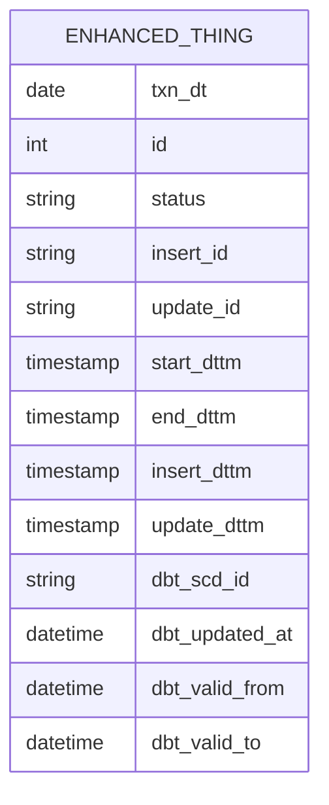
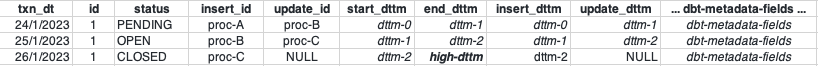

# Adding operational metadata to dbt snapshots

> See the article at [__enhancing-dbt-snapshots-with-operational-metadata__](https://fullstackchronicles.io/enhancing-dbt-snapshots-with-operational-metadata) for a full description.  

The `dbt_snapshot_ops_metadata` directory in this repository contains the dbt project that implement an extension to the dbt snapshot materialization macros to add operational metadata to snapshot tables.

Using the dbt snapshot materialization macros, the following operational metadata fields are added to snapshot tables:

* `insert_id` - the process id of the job that inserted the record
* `update_id` - the process id of the job that updated the record
* `start_dttm` - the start date/time of the record
* `end_dttm` - the end date/time of the record
* `insert_dttm` - the date/time the record was inserted
* `update_dttm` - the date/time the record was updated

As shown here:  

