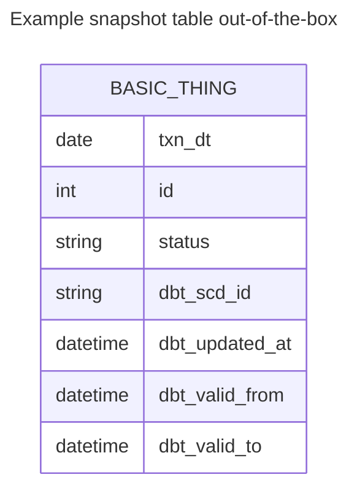
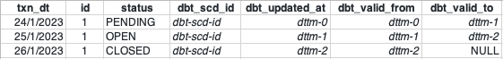
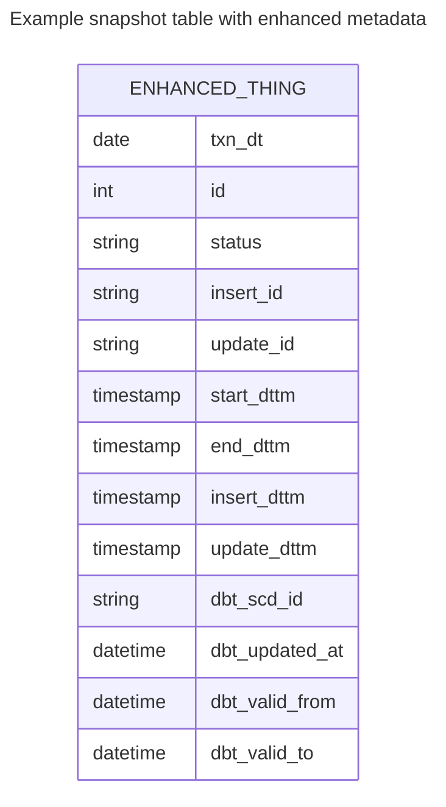

# Enhancing dbt Snapshots with Operational Metadata
The out-of-the-box [dbt snapshots](https://docs.getdbt.com/docs/build/snapshots) provide change data capture (CDC) capability for tracking the changes to data in your
data lake or data warehouse.  The dbt snapshot metadata columns enable a view of change to data - which records 
have been updated when.   However, the dbt snapshot metadata doesn't provide a view of processing audit - which process
or job was responsible for the changes.  Processing level auditability requires additional operational metadata.

The out-of-the-box dbt snapshot strategies (rules for detecting changes) likely provide the desired logic for detecting and managing data change.
No change to the snapshot strategies or snapshot pipeline processing is desired, but additional operational metadata
fields must be set and carried through with the data.

## Objectives
The need for greater fidelity of operational metadata can be driven by both operational and governance requirements.
Example considerations could include:
* use of the out-of-the-box dbt snapshot logic and strategies for Change Data Capture (CDC)
* addition of operational metadata fields to snapshot tables with processing details for ops support and audit
  - when new records are inserted, add operational processing metadata information to each record
  - when existing records are closed or end-dated, update operational metadata fields with processing metadata






Aside from including a new process_id value into records, these enhancements don't add new information to the
table.  Rather they are a materialisation of the operational data that is easier to access.  The same information
could be derived from standard dbt metadata fields, but would require a more complex SQL statement that includes
a left outer self join.  As with any materialization decision, there is the trade off between ease of access
vs additional storage requirements.

### NULLS vs High End Date/Timestamp
In addition to the ops support and audit requirements, there can also be a legacy migration complication
related to how open records (the most current version of the record) are represented snapshots.  dbt snapshots
represent open records using `NULL` values for `valid_to` fields.
In legacy data lakes or data warehouses, the open records often are identified by using a
well-known high value for the effective end date/timestamp, such as `9999-12-31` or `9999-12-31 23:59:59`.  Adding
additional snapshot metadata columns enables a legacy view of record changes without having to alter the
dbt snapshot strategy or processing logic.


Note that transitioning to the use of `NULL` values for the `valid_to` end date/timestamp value for open records
is `HIGHLY` recommended, especially if porting to a new database platform or cloud based service.  On-premise
legacy database platforms often use `TIMESTAMP` values without inclusion of timezones or timezone offests
relying on a system wide default timezone setting.
Different databases may also have different millisecond precision for `TIMESTAMP` columns.
When migrating to a new database platform, both precision and timezone treatment can cause unexpected issues.

For example, in BigQuery
```
datetime('9999-12-31 23:59:59.999999', 'Australia/Melbourne')
```
will generate an invalid value error, while
```
timestamp('9999-12-31 23:59:59.999999', 'Australia/Melbourne')
```
will silently convert the localised timestamp to UTC `9999-12-31 23:59:59.999999+00`

The use of `NULL` values for open records/`valid_to` fields avoids this risk of subtle breakage.

## Enhancing the default Snapshot
Modify the default dbt snapshot behaviour by overriding the [dbt snapshot materialization macros](https://github.com/dbt-labs/dbt-core/tree/main/core/dbt/include/global_project/macros/materializations/snapshots).
dbt enbles customisation of macros using the following resolution or search order:
* locally defined macros in the project's ./macros directory
* macros defined in additional dbt packages included in the project `packages.yml` file
* dbt provided macros

To inject additional snapshot metadata fields into in snapshot tables override the following two default macros:
* `default__build_snapshot_table()` creates the snapshot table on first run
* `default__snapshot_staging_table()` stages in the inserts and updates to be applied to the snapshot table

To update fields on an snapshot update override the following default macro:
* `default__snapshot_merge_sql()` performs the MERGE/UPSERT 

Note that if the dbt database adaptor implements customised versions of these macros, then update
the adaptor specific macro accordingly.  For example the [dbt-spark](https://github.com/dbt-labs/dbt-spark/blob/main/dbt/include/spark/macros/materializations/snapshot.sql) adaptor overrides the
dbt `default__snapshot_merge_sql()`

### build_snapshot_table()
The [default__build_snapshot_table()](./dbt_snapshot_ops_metadata/macros/default__build_snapshot_table.sql) macro is called on the first `dbt snapshot` invocation.  This
macro defines the content to include in the `CREATE TABLE` statement.  The following example adds 
process id's using the dbt `invocation_id` and adds additional timestamp fields, including use of the
well-known high timestamp value for open records.  This value is defined as the variable `default_high_dttm`
in the `dbt_project.yml` file.  The dbt snapshot strategy processing uses the unmodified
standard dbt columns so modifications to processing code is not required.

dbt project macro `./macros/default__build_snapshot_table.sql`
```sql

{#- customised snapshot table to inject additional operational metadata #}

    select *, 
        {#- additional operational metadata fields #}
        cast("{{ invocation_id }}" as STRING) as INSERT_PROCESS_ID,
        cast(NULL as STRING) as UPDATE_PROCESS_ID,
        {{ strategy.updated_at }} as EFFECTIVE_START_TIMESTAMP,
        cast("{{ var('default_high_dttm') }}" as TIMESTAMP) as EFFECTIVE_END_TIMESTAMP,
        {{ strategy.updated_at }} as INSERT_TIMESTAMP,
        cast(NULL as TIMESTAMP) as UPDATE_TIMESTAMP,

        {#- dbt standard snapshot fields #}
        {{ strategy.scd_id }} as dbt_scd_id,
        {{ strategy.updated_at }} as dbt_updated_at,
        {{ strategy.updated_at }} as dbt_valid_from,
        nullif({{ strategy.updated_at }}, {{ strategy.updated_at }}) as dbt_valid_to
    from (
        {{ sql }}
    ) sbq


```

### snapshot_staging_table()
The [default__snapshot_staging_table()](./dbt_snapshot_ops_metadata/macros/default__snapshot_staging_table.sql) macro is called on subsequent `dbt snapshot` invocations.  This macro
defines the content to include in the `MERGE` statement for inserts and updates.  The following example adds
the additional operational metadata fields to the `insertions` common table expression (CTE) and the `updates` (CTE).
The dbt `invocation_id` is used again as the `process_id` for inserts on new records and updates that
close old records.

```sql
    ...
    insertions as (

        select
            'insert' as dbt_change_type,
            source_data.*,
            {#- additional operational metadata fields #}
            cast("{{ invocation_id }}" as STRING) as INSERT_PROCESS_ID,
            cast(NULL as STRING) as UPDATE_PROCESS_ID,
            {{ strategy.updated_at }} as EFFECTIVE_START_TIMESTAMP,
            cast("{{ var('default_high_dttm') }}" as TIMESTAMP) as EFFECTIVE_END_TIMESTAMP,
            {{ strategy.updated_at }} as INSERT_TIMESTAMP,
            cast(NULL as TIMESTAMP) as UPDATE_TIMESTAMP
        from insertions_source_data as source_data
        left outer join snapshotted_data on snapshotted_data.dbt_unique_key = source_data.dbt_unique_key
        where snapshotted_data.dbt_unique_key is null
           or (
                snapshotted_data.dbt_unique_key is not null
            and (
                {{ strategy.row_changed }}
            )
        )

    ),

    updates as (

        select
            'update' as dbt_change_type,
            source_data.*,
            snapshotted_data.dbt_scd_id,
            {#- additional operational metadata fields #}
            snapshotted_data.INSERT_PROCESS_ID,
            cast("{{ invocation_id }}" as STRING) as UPDATE_PROCESS_ID,
            snapshotted_data.EFFECTIVE_START_TIMESTAMP,
            {{ strategy.updated_at }} as EFFECTIVE_END_TIMESTAMP,
            snapshotted_data.INSERT_TIMESTAMP,
            {{ strategy.updated_at }} UPDATE_TIMESTAMP
        from updates_source_data as source_data
        join snapshotted_data on snapshotted_data.dbt_unique_key = source_data.dbt_unique_key
        where (
            {{ strategy.row_changed }}
        )
    )
    ...
```
Note that the `deletes` CTE has not been updated with the additional fields.  In scenarios that use the 
hard deletes feature, the `deletes` CTE would need to be modified as well.

### snapshot_merge_sql()
The [default__snapshot_merge_sql()](./dbt_snapshot_ops_metadata/macros/default__snapshot_merge_sql.sql) macro is called to perform the MERGE/UPSERT into the target snapshot
table.  This macro defines how fields in the records being closed should be updated.  The `update set`
section of the `MERGE` statement defines the update columns and values.
```sql

{#- customised snapshot merge statement to update additional operational metadata #}
    

    merge into {{ target }} as DBT_INTERNAL_DEST
    using {{ source }} as DBT_INTERNAL_SOURCE
    on DBT_INTERNAL_SOURCE.dbt_scd_id = DBT_INTERNAL_DEST.dbt_scd_id

    when matched
     and DBT_INTERNAL_DEST.dbt_valid_to is null
     and DBT_INTERNAL_SOURCE.dbt_change_type in ('update', 'delete')
        then update
        set 
            dbt_valid_to = DBT_INTERNAL_SOURCE.dbt_valid_to,
            {#- additional operational metadata fields to be updated #}
            EFFECTIVE_END_TIMESTAMP = DBT_INTERNAL_SOURCE.EFFECTIVE_END_TIMESTAMP,
            UPDATE_PROCESS_ID = DBT_INTERNAL_SOURCE.UPDATE_PROCESS_ID,
            UPDATE_TIMESTAMP = DBT_INTERNAL_SOURCE.UPDATE_TIMESTAMP

    when not matched
     and DBT_INTERNAL_SOURCE.dbt_change_type = 'insert'
        then insert ({{ insert_cols_csv }})
        values ({{ insert_cols_csv }})


```

## Conclusion
Overriding the default dbt snapshot macros enables the injection and updating of additional operational
metadata in snapshot tables.  Fields can be added such that the provided dbt logic and snapshot
strategy processing is still applied, but the resulting snapshot tables contain the columns required
for the data lake or data warehouse.

The sample dbt project in [dbt_snapshot_ops_metadata](./dbt_snapshot_opsmetadata) contains an implementation
of the snapshot customisation.